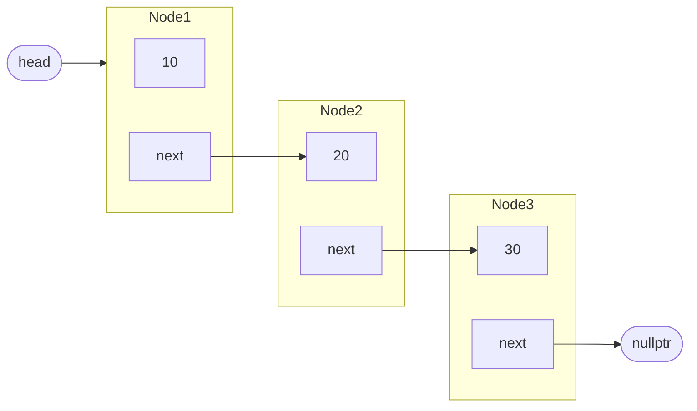
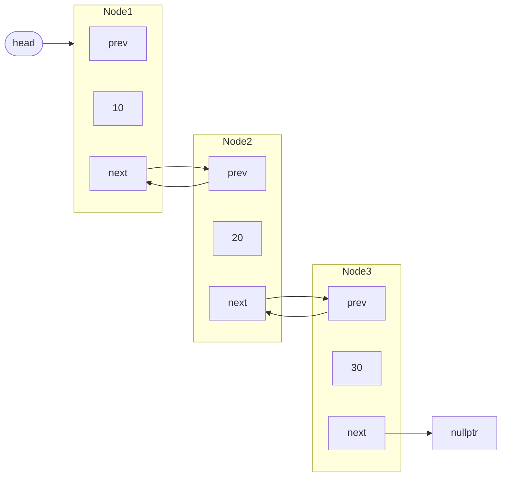

# 연결된 자료 구조

## 연결 리스트
연결 리스트linked list는 대표적인 연결된 자료 구조로 각 데이터 덩어리노드들이 각자 메모리 영역에 흩어져서 저장되며, 각 노드들은 다음 노드의 주소값을 가지고 있는 자료구조입니다.

## 노드
노드node는 연결 리스트의 기본 구성 요소입니다.
노드는 다음으로 구성됩니다.
1. 데이터 : 실제 저장되는 값입니다.
2. 링크link : 다음 노드를 가리키는 포인터입니다.

## 작동 방식
1. 헤드 포인터head pointer : 연결 리스트의 맨 처음 노드를 가리키는 포인터입니다. 해당 포인터가 사라지면 연결 리스트 전체에 접근할 수 없게 됩니다.
2. 순차적 연결sequential connection : 연결 리스트는 처음 노드에서 시작해 다음 노드로 순차적으로 접근 가능합니다.
3. 널 포인터null pointer : 연결 리스트의 마지막에는 nullptr가 있으며 끝을 나타냅니다.

## 배열 대 연결 리스트

| 조건 | 배열array | 연결 리스트 |
|:---:|:---:|:---:|
| 기반 자료 구조 | 연속된 자료 구조 | 연결된 자료 구조 |
| 크기 | 컴파일 시점에 정해짐 | 필요에 따라 늘어남 |
| 포인터 오버 헤드 | 없음 | 각 노드 당 하나 |
| `size()` 함수 속도 | $$O(1)$$ | $$O(n)$$ |
| 임의 접근 | $$O(1)$$ | $$O(n)$$ |
| 맨 앞 삽입 | $$O(n)$$ | $$O(1)$$ |
| 중간 삽입 | $$O(n)$$ | 현 위치 : $$O(1)$$   특정 위치 : $$O(n)$$ |
| 맨 뒤 삽입 | $$O(1)$$ | $$O(n)$$ |
| 캐시 지역성 | 있음 | 없음 |

## 구조
- 단일 연결 리스트

- 이중 연결 리스트

## 표준 라이브러리
연결된 자료 구조의 표준 라이브러리는 `std::list`, `std::forward_list`가 있습니다.
- `std::list` : 이중 연결 리스트로 앞뒤 양방향으로 순회가 가능하며 오버헤드가 노드당 포인터 2개씩입니다.
- `std::forward_list` : 단일 연결 리스트로 앞에서 뒤로의 순회만 가능합니다. 
다음 챕터에서 `std::forward_list`의 멤버함수들을 살펴보며 간단히 직접 구현해보겠습니다.

## 멤버 함수
`std::forwars_list`의 멤버 함수들입니다.
구현에 사용할 멤버 함수들은 **굵게** 혹은 ● 처리되있습니다.
- 생성자/소멸자
	1. **기본 생성자**
		- `forward_list<T>()`
			원소가 없는 연결리스트를 생성함니다.
	2. 반복자 기반 생성자
		- `forward_list(InputIt first, InputIt last, ..)` 
			first부터 last까지의 반복자로 원소를 채우며 생성합니다.
	3. 복사/이동 생성자
		- `forward_list(const forward_list& other)`
		- `forward_list(forward_list&& other)` 
			다른 연결 리스트를 복사하거나 이동해 생성합니다.
	4. **채움 생성자**
		- `forward_list(size_t count, const T& value, ..)`
			count개의 value로 된 원소를 추가하며 생성합니다.
	5. 초기화 리스트 생성자
		- `forward_list( std::initializer_list<T> init, ...)`
			초기화 리스트의 각 원소들을 원소로 갖는 연결 리스트를 생성합니다.
- 할당자
	- `allocator_type get_allocator() const`
		생성시 사용한 할당자를 반환합니다.
- 대입
	- `forward_list& operator=(const forward_list& other)`
	- `forward_list& operator=(forward_list&& other)`
	- forward_list& operator=(initializer_list ilist)
		다른 `forward_list`, `initalizer_list`를 복사 /이동해 대입합니다.
	- `void assign(size_t count, const T& val)`
	- `void assign(InputIt first, InputIt last, ..)`
	- `void assign(initializer_list ilist)`
		`count`개의 `value`로 또는 `[first, last)`범위의 요소들, 혹은 초기화 리스트로 대입합니다.
- **원소 접근**
	- `T& front()` 
	- `const T& front() const`
		맨 앞 요소를 반환합니다.
- 용량
	- `bool empty() const` ●
		요소가 비었는지 확인합니다.
	- `size_t max_size() const`
		연결 리스트의 최대 크기를 반환합니다.
- **변경**
	- `void clear()` ●
		모든 요소를 삭제합니다.
	- `void push_front(const T& value)` ●
	- `void push_front(T&& value)` ●
		맨 앞에 요소를 삽입합니다.
	- `reference emplace_front(Args& ... args)` 
		- 맨 앞에 생성자 인자를 활용해 직접 삽입합니다. 
		- 삽입된 요소에 대한 참조를 반환합니다.
	- `iterator insert_after(const_iterator pos, const T& value)` ●
	- `iterator insert_after(const_iterator pos, size_t count, const T& value)`
	- `iterator insert_after(const_iterator pos, InputIt first, InputIt last)`
	- `iterator insert_after(const_iterator pos, initializer_list ilist)`
		- 특정 요소 뒤에 요소(들)를 삽입합니다.
		- 삽입된 요소중 가장 마지막 요소를 반환합니다.
	- `iterator emplace_after(const_iterator pos, Args... args)` 
		- 특정 요소 뒤에 생성자 인자를 활용해 직접 요소를 삽입합니다. 
		- 삽입된 요소 중 가장 마지막 요소를 반환합니다.
	- `void pop_front()` ●
		맨 앞 요소를 제거합니다.
	- `iterator erase_after(const_iterator pos)` ●
	- `iterator erase_after(const_iterator pos, const_iterator last)`
		- 특정 요소 뒤 요소(들)를 삭제합니다.
	- `void resize(size_t count)` ●
	- `void resize(size_t count, const T& value)` ●
		- 연결 리스트의 크기를 `count`로 키우거나 줄이고 남은 자리에는 0 또는 `value`로 채웁니다.
	- `void swap(forward_list& other)`
		다른 `forward_list`와 원소들을 바꿉니다.
- 연산
	- `void merge(forward_list& other)` ●
	- `void merge(forward_list&& other)` ●
	- `void merge(forward_list& other, Compare compare=std:less<>)` 
	- `void merge(forward_list&& other, Compare compare=std::less<>)` 
		- 비교자를 이용해 두 연결 리스트를 합칩니다.
		- 기본적으로 std::less<>가 설정됩니다.
	- `void splice_after( const_iterator pos, forward_list& other )` ● 
	- `void splice_after( const_iterator pos, forward_list&& other )` ●
	- `void splice_after( const_iterator pos, forward_list& other, const_iterator it )`
	- `void splice_after( const_iterator pos, forward_list&& other, const_iterator it )`
	- `void splice_after( const_iterator pos, forward_list& other, const_iterator first, const_iterator last )`
	- `void splice_after( const_iterator pos, forward_list&& other, const_iterator first, const_iterator last )`
		- `pos` 위치에 다른 연결 리스트의 요소들을 잘라 붙힙니다.
	- `size_t remove(const T& value)` ●
	- `size_t remove_if(UnaryPredicate p)`
		- `value`와 일치하는 혹은 `p` 조건을 만족하는 모든 요소를 삭제합니다.
		- 삭제된 요소의 개수를 반환합니다.
	- `void reverse()` ●
		연결 리스트를 뒤집습니다.
	- `void unique()` : 연결 리스트의 중복된 요소를 제거합니다.
	- `void sort()`  ●
		연결 리스트를 정렬합니다.
- 반복자 
	- `iterator before_begin()` ●
	- `const_iterator before_begin() const` ●
	- `const_iterator cbefore_begin() const`
		- 첫번째 요소 전의 반복자를 반환 합니다.
	- `iterator begin()` ●
	- `const_iterator begin() const` ●
	- `const_iterator cbegin() const
		- 첫번째 요소의 반복자를 반환합니다.
	- `iterator end()` ●
	- `const_iterator end() const` ●
	- `const_iterator cend() const
		- 마지막 요소의 반복자를 반환함니다.

## 구현

 - 연결 리스트에 사용될 노드 구현

 
	
#include <utility>
// std::move()를 사용하기 위함
	
template <typename T>
struct Node {
     T data; // 실제 데이터 저장
     Node* next; // 다음 노드를 가리키는 포인터
		
     // l-value에 대한 복사 생성자
     // l-value: 이름이 있고 주소값을 가리키는 보통 대입문의 왼쪽에 오는 표현식(예로 변수)
     Node(const T& val): data(val), next(nullptr) {}
		
     // r-value에 대한 이동 생성자
     // r-value: 이름이 없고 임시적인 값 보통 대입문의 오른쪽에 오는 표현식(예로 "string", x + y)
     Node(T&& val): data(std::move(val)), next(nullptr) {}
		
     // 기본 생성자
     Node(): next(nullptr) {}
}; 

 

 - 연결 리스트 생성자 및 소멸자 구현

 

#include <utility>
// std::move()를 사용하기 위함
#include <stsexcept>
// 에러 처리를 위함
	
template <typename T>
class MyLinkedList {
 public: 
     struct Node {
         T data;
         Node* next;
			
         Node(const T& val): data(val), next(nullptr) {}
			
         Node(T&& val): data(std::move(val)), next(nullptr) {}
			
         Node(): next(nullptr) {}
     }; 
 private:
     Node* headPointer;
		
 public:
		
     // MyLinkedList 기본 생성자
     MyLinkedList() {
         headPointer = new Node<T>();
     }
		
     // 채움 생성자
     MyLinkedList(size_t count, const T& val){
         headPointer = new Node<T>();
         try{
             for(size_t i = 0; i < count; i++){
                 // 맨 앞에 노드 추가
                 push_front(val);
             }
         } catch (const std::bad_alloc& e) {
             // bad_alloc 발생 시 롤백 후 에러 발생
             clear();
             throw;
         } catch(...) {
             clear();
             throw;
         }
     }
		
     // 소멸자
     ~MyLinkedList() {
         // 모든 노드 제거
          clear();
         // headPointer 할당 해제
         delete headPointer;
         // Dangling Pointer 예방을 위한 nullptr 할당
         headPointer = nullptr;
     }
		
     // Rule of Five 처리 (복사/이동 금지)
     MyLinkedList(const MyLinkedList&) = delete;
     MyLinkedList& operator=(const MyLinkedList&) = delete;
     MyLinkedList(MyLinkedList&&) = delete;
     MyLinkedList& operator=(MyLinkedList&&) = delete;
};
		

 

 - 멤버 함수 구현 1

 
	
#include <utility>
#include <stdexcept>
	
template <typename T>
class MyLinkedList {
		
 public: 
     struct Node {
         T data;
         Node* next;
			
         Node(const T& val): data(val), next(nullptr) {}
			
         Node(T&& val): data(std::move(val)), next(nullptr) {}
			
         Node(): next(nullptr) {}
     };
			
 private:
		
     Node* headPointer;
		
 public:
		
     MyLinkedList() {
         headPointer = new Node<T>();
     }
		
     MyLinkedList(size_t count, const T& val){
         headPointer = new Node<T>();
         try{
             for(size_t i = 0; i < count; i++){
                 // 맨 앞에 노드 추가
                 push_front(val);
             }
         } catch (const std::bad_alloc& e) {
             clear();
             throw;
         } catch(...) {
             clear();
             throw;
         }
     }
		
     ~MyLinkedList() {
         clear();
         delete headPointer;
         headPointer = nullptr;
     }
		
     MyLinkedList(const MyLinkedList&) = delete;
     MyLinkedList& operator=(const MyLinkedList&) = delete;
     MyLinkedList(MyLinkedList&&) = delete;
     MyLinkedList& operator=(MyLinkedList&&) = delete;
     
     /* ** Start Here ** */
     // 구현 시작
     // 모든 노드를 삭제하는 erase() 멤버 함수
     void clear(){
         // 맨 앞 노드를 가리키는 포인터(현재 노드)
         Node* curr = headPointer->next;
         // 현재 노드가 nullptr가 될 때까지
         while(curr != nullptr) {
             // 현재 노드를 임시 포인터에 저장함.
             Node* tmp = curr;
             // 현재 노드를 다음 노드로 옮김.
             curr = curr->next;
             // 이전 노드를 삭제
             delete tmp;
         }
         // 첫 번째 노드 포인터를 삭제
         headPointer->next = nullptr;
     }
		
     // 맨 앞에 노드를 추가하는 lvalue push_front() 멤버 함수
     void push_front(const T& val) {
         // val 값을 갖는 새로운 노드(복사 생성)
         Node* newNode = 
         new Node<T>(val);
         // 새로운 노드의 뒤에 이전의 첫번째 노드를 연결
			
         newNode->next = headPointer->next;
         // 헤드포인터를 새로운 첫번째 노드에 연결
			
         headPointer->next = newNode;
     }
		
     // 맨 앞에 노드를 추가하는 rvalue push_front() 멤버 함수
     void push_front(T&& val) {
         // r-value val 값을 갖는 새로운 노드 생성(이동 생성)
         Node* newNode = new Node<T>(std::move(val));
         // 새로운 노드의 뒤에 이전의 첫번째 노드를 연결
         newNode->next = headPointer->next;
         // 헤드 포인터를 새로운 첫번째 노드에 연결
         headPointer->next = newNode;
     }
			
     // 연결 리스트가 비었는지 확인하는 empty() 멤버 함수
     bool empty() const {
         // 헤드 포인터가 nullptr를 향하는지 확인
         return headPointer->next == nullptr;
     }
		
     // 연결 리스트의 특정 노드 뒤에 새로운 노드를 삽입하는 insert_after() 멤버함수
     void insert_after(Node* pos, const T& val) {
         // pos가 nullptr이면 아무것도 하지 않음.
         if(pos == nullptr) return;
         // val 값을 갖는 새로운 노드 생성
         Node* newNode = new Node<T>(val);
         // 새로운 노드 뒤에 특정 노드 뒤에 있던 노드들을 연결
         newNode->next = pos->next;
         // 새로운 노드를 특정 노드 뒤에 연결
         pos->next = newNode;
     }
		
     void insert_after(Node* pos, T&& val){
         if(pos == nullptr) return;
         // val 값을 갖는 새로운 노드 생성
         Node* newNode = new Node<T>(std::move(val));
         // 새로운 노드 뒤에 특정 노드 뒤에 있던 노드들을 연결
         newNode->next = pos->next;
         // 새로운 노드를 특정 노드 뒤에 연결
         pos->next = newNode;
     }
		
     // 맨 앞 노드를 삭제하는 pop_front() 멤버 함수
     void pop_front(){
         // 만약 empty() == True일시 아무것도 하지 않음
         if(empty()) return;
         // 첫번째 노드를 가리키는 임시 포인터
         Node* tmp = headPointer->next;
         // 헤드포인터를 두번째 노드로 옮김
         headPointer->next = tmp->next;
         // 첫번째 노드 삭제
         delete tmp;
     }
			
     // 첫번째 값을 반환하는 front() 멤버 함수
     T& front(){
         // 만약 empty() == True일시 에러 발생
         if(empty())  {
             throw std::out_of_range("Linked List is empty");
         }
         // 첫번째 노드의 data를 반환
         return headPointer->next->data;
     }
		
     const T& front() const {
         // 만약 empty() == True일시 에러 발생
         if(empty())  {
             throw std::out_of_range("Linked List is empty");
         }
         // 첫번째 노드의 data를 반환
         return headPointer->next->data;
     }
		
     // 특정 노드 뒤의 노드를 삭제하는 erase_after() 멤버 함수
     void erase_after(Node* pos){
         // 만약 특정 노드가 nullptr이거나 특정 노드 다음 노드가 없으면 아무것도 하지 않음
         if(pos == nullptr || pos->next == nullptr){
             return;
         }
         // 다음 노드에 대한 임시 포인터
         Node* tmp = pos->next;
         // 특정 노드 뒤에 다다음 노드 연결
         pos->next = tmp->next;
         // 다음 노드 삭제
         delete tmp;
     }
};
 


 - 기타 멤버 함수들 구현



#include <utility>
#include <stdexcept>
	
template <typename T>
class MyLinkedList {
		
public:
     struct Node {
         T data;
         Node* next;
			
         Node(const T& val): data(val), next(nullptr) {}
			
         Node(T&& val): data(std::move(val)), next(nullptr) {}
			
         Node(): next(nullptr) {}
     };
		
 private:
		
     Node* headPointer;
		
 public:
		
     MyLinkedList() {
         headPointer = new Node();
     }
		
     MyLinkedList(size_t count, const T& val){
         headPointer = new Node();
         try{
             for(size_t i = 0; i < count; i++){
                 push_front(val);
             }
         } catch(const std::bad_alloc& e){
             clear();
             throw;
         } catch(...){
             clear();
             throw;
         }
     }
		
     ~MyLinkedList() {
          clear();
         delete headPointer;
         headPointer = nullptr;
     }
		
     MyLinkedList(const MyLinkedList&) = delete;
     MyLinkedList& operator=(const MyLinkedList&) = delete;
     MyLinkedList(MyLinkedList&&) = delete;
     MyLinkedList& operator=(MyLinkedList&&) = delete;
		
     void clear(){
         Node* curr = headPointer->next;
         while(curr != nullptr) {
             Node* tmp = curr;
             curr = curr->next;
             delete tmp;
         }
         headPointer->next = nullptr;
     }
		
     void push_front(const T& val) {
         Node* newNode =
         new Node(val);
         newNode->next = headPointer->next;
         headPointer->next = newNode;
     }
		
     void push_front(T&& val) {
         Node* newNode =
         new Node(std::move(val));
         newNode->next = headPointer->next;
         headPointer->next = newNode;
     }
		
     bool empty() const {
         return headPointer->next == nullptr;
     }
		
     void insert_after(Node* pos, const T& val) {
         if(pos == nullptr) return;
         Node* newNode = new Node(val);
         newNode->next = pos->next;
         pos->next = newNode;
     }
		
     void insert_after(Node* pos, T&& val){
         if(pos == nullptr) return;
         Node* newNode = new Node(std::move(val));
         newNode->next = pos->next;
         pos->next = newNode;
     }
		
     void pop_front(){
         if(empty()) return;
         Node* tmp = headPointer->next;
         headPointer->next = tmp->next;
         delete tmp;
     }
		
     T& front(){
         if(empty())  {
             throw std::out_of_range("Linked List is empty");
         }
         return headPointer->next->data;
     }
		
     const T& front() const {
         if(empty())  {
             throw std::out_of_range("Linked List is empty");
         }
         return headPointer->next->data;
     }
		
     void erase_after(Node* pos){
         if(!pos || !pos->next){
             return;
         }
         Node* tmp = pos->next;
         pos->next = tmp->next;
         delete tmp;
     }
     
     /* ** Start Here ** */
     // 구현 시작
     // 모든 요소를 정렬하는 sort() 멤버 함수
     // 최악, 최선 O(n log(n))의 병합 정렬
     void sort(){
         // 재귀를 위한 merge_sort() 사용
         headPointer->next = merge_sort(headPointer->next);
     }
		
     // val과 같은 값을 갖는 모든 요소 삭제
     size_t remove(const T& val){
         size_t count = 0;
         Node* curr = headPointer;
         while(curr->next){
             if(curr->next->data == val){
                 erase_after(curr);
                 count++;
             }
             else {
                 curr = curr->next;
             }
         }
         return count;
     }
		
     // 특정 요소 뒤의 요소들을 다른 연결 리스트의 요소들을 잘라 붙히기
     void splice_after(Node* pos, MyLinkedList& other){
         if(!pos || other.empty()) return;
			
         Node* last = other.getHeadPointer()->next;
         while(last->next != nullptr){
             last = last->next;
         }
         last->next = pos->next;
         pos->next = other.getHeadPointer()->next;
         other.clear();
     }
		
     void splice_after(Node* pos, MyLinkedList&& other){
         splice_after(pos, other);
     }
		
     // headPointer 반환
     Node* getHeadPointer() {
         return headPointer;
     }
		
     const Node* getHeadPointer() const {
         return headPointer;
     }
		
     // 다른 연결 리스트와 정렬 병합하는 merge() 멤버함수
     // other는 비워집니다.
     // O(n)의 시간복잡도
     void merge(MyLinkedList& other){
         headPointer->next = sort_merge(headPointer->next, other.getHeadPointer()->next);
         other.getHeadPointer()->next = nullptr;
     }
		
     // 요소의 개수를 변경하는 resize() 멤버함수
     void resize(size_t count, const T& value = T()){
         size_t index = 0;
         Node* curr = headPointer;
			
         while(index < count){
             if(!curr->next){
                 insert_after(curr, value);
             }
             curr = curr->next;
             index++;
         }
         while(curr->next){
             erase_after(curr);
         }
     }
		
     // 리스트의 모든 값의 앞뒤를 바꾸는 reverse() 멤버 함수
     void reverse() {
         Node* prev = nullptr;
         Node* curr = headPointer->next;
         Node* next = nullptr;
		    
         while (curr) {
             next = curr->next;   // 다음 노드 기억
             curr->next = prev;   // 포인터 방향 반대로
             prev = curr;         // prev 이동
             curr = next;         // curr 이동
         }
         headPointer->next = prev;  // 새 헤드 연결
     }
		
 private:
     Node* merge_sort(Node* head){
			
         if(!head || !head->next) return head;
			
         Node* slow = head;
         Node* fast = head->next;
			
         // Slow-Fast 기법 사용해 가운데 노드 찾기
         while(fast && fast->next){
             slow = slow->next;
             fast = fast->next->next;
         }
			
         Node* mid = slow->next;
         slow->next = nullptr;
			
         Node* left = merge_sort(head);
         Node* right = merge_sort(mid);
			
         return sort_merge(left, right);
     }
		
     Node* sort_merge(Node* thisFront, Node* otherFront){
         //더미 노드
         Node dummy;
         // 병합된 리스트의 끝
         Node* tail = &dummy;
			
         // 두 리스트를 병합
         // 기본적으로 std::less<>
         while(thisFront && otherFront){
             if(thisFront->data <= otherFront->data){
                 // this 리스트의 맨 앞이 더 작은 경우 
                 tail->next = thisFront;
                 thisFront = thisFront->next;
             }
             else{
                 // other 리스트의 맨 앞이 더 작은 경우 
                 tail->next = otherFront;
                 otherFront = otherFront->next;
             }
             // 병합된 노드로 이동
             tail = tail->next;
         }
			
         tail->next = thisFront ? thisFront : otherFront;
			
         return dummy.next;
     }
};


 - 반복자 추가


#include <utility>
#include <stdexcept>
	
template <typename T>
class MyLinkedList {
	
public:
     struct Node {
         T data;
         Node* next;
			
         Node(const T& val): data(val), next(nullptr) {}
			
         Node(T&& val): data(std::move(val)), next(nullptr) {}
			
         Node(): next(nullptr) {}
     };
		
 private:
		
     Node* headPointer;
		
 public:
		
     MyLinkedList() {
         headPointer = new Node();
     }
		
     MyLinkedList(size_t count, const T& val){
         headPointer = new Node();
         try{
             for(size_t i = 0; i < count; i++){
                 push_front(val);
             }
         } catch (const std::bad_alloc& e) {
             clear();
             throw;
         } catch(...) {
             clear();
             throw;
         }
     }
		
     ~MyLinkedList() {
          clear();
         delete headPointer;
         headPointer = nullptr;
     }
		
     MyLinkedList(const MyLinkedList&) = delete;
     MyLinkedList& operator=(const MyLinkedList&) = delete;
     MyLinkedList(MyLinkedList&&) = delete;
     MyLinkedList& operator=(MyLinkedList&&) = delete;
		
     void clear(){
         Node* curr = begin();
         while(curr != nullptr) {
             Node* tmp = curr;
             curr = curr->next;
             delete tmp;
         }
         headPointer->next = nullptr;
     }
		
     void push_front(const T& val) {
         Node* newNode =
         new Node(val);
         newNode->next = begin();
         headPointer->next = newNode;
     }
		
     void push_front(T&& val) {
         Node* newNode =
         new Node(std::move(val));
         newNode->next = begin();
         headPointer->next = newNode;
     }
		
     bool empty() const {
         return begin() == nullptr;
     }
		
     void insert_after(Node* pos, const T& val) {
         if(pos == nullptr) return;
         Node* newNode = new Node(val);
         newNode->next = pos->next;
         pos->next = newNode;
     }
		
     void insert_after(Node* pos, T&& val){
         if(pos == nullptr) return;
         Node* newNode = new Node(std::move(val));
         newNode->next = pos->next;
         pos->next = newNode;
     }
		
     void pop_front(){
         if(empty()) return;
         Node* tmp = begin();
         headPointer->next = tmp->next;
         delete tmp;
     }
		
     T& front(){
         if(empty())  {
             throw std::out_of_range("Linked List is empty");
         }
         return begin()->data;
     }
		
     const T& front() const {
         if(empty())  {
             throw std::out_of_range("Linked List is empty");
         }
         return begin()->data;
     }
		
     void erase_after(Node* pos){
         if(!pos || !pos->next){
             return;
         }
         Node* tmp = pos->next;
         pos->next = tmp->next;
         delete tmp;
     }
		
     void sort(){
         headPointer->next = merge_sort(begin());
     }
		
     size_t remove(const T& val){
         size_t count = 0;
         Node* curr = before_begin();
         while(curr->next){
             if(curr->next->data == val){
                 erase_after(curr);
                 count++;
             }
             else {
                 curr = curr->next;
             }
         }
         return count;
     }
		
     void splice_after(Node* pos, MyLinkedList& other){
         if(!pos || other.empty()) return;
			
         Node* last = other.begin();
         while(last->next != nullptr){
             last = last->next;
         }
         last->next = pos->next;
         pos->next = other.begin();
         other.before_begin()->next = nullptr;
     }
		
     void splice_after(Node* pos, MyLinkedList&& other){
         splice_after(pos, other);
     }
		
     void merge(MyLinkedList& other){
         headPointer->next = sort_merge(begin(), other.begin());
         other.before_begin()->next = nullptr;
     }
		
     void resize(size_t count, const T& value = T()){
         size_t index = 0;
         Node* curr = before_begin();
			
         while(index < count){
             if(!curr->next){
                 insert_after(curr, value);
             }
             curr = curr->next;
             index++;
         }
         while(curr->next){
             erase_after(curr);
         }
     }
		
     void reverse() {
         Node* prev = nullptr;
         Node* curr = begin();
         Node* next = nullptr;
		    
         while (curr) {
             next = curr->next;
             curr->next = prev;
             prev = curr;
             curr = next;
         }
         headPointer->next = prev;
     }
		
     /* ** Start Here ** */
     /* ~~~ */
     // 구현 시작
     Node* begin() {
         return headPointer->next;
     }
		
     const Node* begin() const {
         return headPointer->next;
     }
		
     Node* end() {
         return nullptr;
     }
		
     const Node* end() const {
         return nullptr;
     }
		
     // getHeadPointer() 대체
     Node* before_begin(){
         return headPointer;
     }
		
     const Node* before_begin() const {
         return headPointer;
     }
		
 private:
     Node* merge_sort(Node* head){
		
         if(!head || !head->next) return head;
			
         Node* slow = head;
         Node* fast = head->next;
			
         while(fast && fast->next){
             slow = slow->next;
             fast = fast->next->next;
         }
			
         Node* mid = slow->next;
         slow->next = nullptr;
			
         Node* left = merge_sort(head);
         Node* right = merge_sort(mid);
			
         return sort_merge(left, right);
     }
		
     Node* sort_merge(Node* thisFront, Node* otherFront){
         Node dummy;
         Node* tail = &dummy;
			
         while(thisFront && otherFront){
             if(thisFront->data <= otherFront->data){
                 tail->next = thisFront;
                 thisFront = thisFront->next;
             }
             else{
                 tail->next = otherFront;
                 otherFront = otherFront->next;
             }
             tail = tail->next;
         }
			
         tail->next = thisFront ? thisFront : otherFront;
			
         return dummy.next;
     }
};


## 테스트



#include <iostream>
#include <string>
#include <vector>
#include <utility>
#include <stdexcept>
#include <cstddef>

template <typename T>
class MyLinkedList {
public:
    struct Node {
        T data;
        Node* next;

        Node(const T& val) : data(val), next(nullptr) {}
        Node(T&& val) : data(std::move(val)), next(nullptr) {}
        Node() : next(nullptr) {}
    };

private:
    Node* headPointer; 

public:
    MyLinkedList() {
        headPointer = new Node(); 
    }

    MyLinkedList(size_t count, const T& val) {
        headPointer = new Node();
        try {
            for (size_t i = 0; i < count; i++) {
                push_front(val);
            }
        } catch (...) {
            clear(); 
            delete headPointer;
            headPointer = nullptr;
            throw; 
        }
    }

    ~MyLinkedList() {
        clear();
        delete headPointer;
        headPointer = nullptr;
    }

    MyLinkedList(const MyLinkedList&) = delete;
    MyLinkedList& operator=(const MyLinkedList&) = delete;
    MyLinkedList(MyLinkedList&&) = delete;
    MyLinkedList& operator=(MyLinkedList&&) = delete;

    void clear() {
        Node* curr = headPointer->next; 
        while (curr != nullptr) {
            Node* tmp = curr;
            curr = curr->next;
            delete tmp;
        }
        headPointer->next = nullptr;
    }

    void push_front(const T& val) {
        Node* newNode = new Node(val);
        newNode->next = headPointer->next;
        headPointer->next = newNode;
    }

    void push_front(T&& val) {
        Node* newNode = new Node(std::move(val));
        newNode->next = headPointer->next;
        headPointer->next = newNode;
    }

    bool empty() const {
        return headPointer->next == nullptr;
    }

    void insert_after(Node* pos, const T& val) {
        if (pos == nullptr) return; 
        Node* newNode = new Node(val);
        newNode->next = pos->next;
        pos->next = newNode;
    }

    void insert_after(Node* pos, T&& val) {
        if (pos == nullptr) return;
        Node* newNode = new Node(std::move(val));
        newNode->next = pos->next;
        pos->next = newNode;
    }

    void pop_front() {
        if (empty()) return;
        Node* tmp = headPointer->next;
        headPointer->next = tmp->next;
        delete tmp;
    }

    T& front() {
        if (empty()) {
            throw std::out_of_range("Linked List is empty");
        }
        return headPointer->next->data;
    }

    const T& front() const {
        if (empty()) {
            throw std::out_of_range("Linked List is empty");
        }
        return headPointer->next->data;
    }

    void erase_after(Node* pos) {
        if (!pos || !pos->next) {
            return;
        }
        Node* tmp = pos->next;
        pos->next = tmp->next;
        delete tmp;
    }

    void sort() {
        headPointer->next = merge_sort(headPointer->next);
    }

    size_t remove(const T& val) {
        size_t count = 0;
        Node* curr = headPointer; 
        while (curr->next) {
            if (curr->next->data == val) {
                erase_after(curr);
                count++;
            } else {
                curr = curr->next;
            }
        }
        return count;
    }

    void splice_after(Node* pos, MyLinkedList& other) {
        if (!pos || other.empty()) return;

        Node* otherListStart = other.headPointer->next;
        if (otherListStart == nullptr) return;

        Node* otherListEnd = otherListStart;
        while (otherListEnd->next != nullptr) {
            otherListEnd = otherListEnd->next;
        }

        otherListEnd->next = pos->next;
        pos->next = otherListStart;
        other.headPointer->next = nullptr; 
    }

    void splice_after(Node* pos, MyLinkedList&& other) {
        splice_after(pos, other);
    }

    void merge(MyLinkedList& other) {
        if (this == &other) return; 
        headPointer->next = sort_merge(headPointer->next, other.headPointer->next);
        other.headPointer->next = nullptr;
    }
    
    void resize(size_t count, const T& value = T()) {
        size_t current_size = 0;
        Node* curr = headPointer;
        while (curr->next != nullptr) {
            curr = curr->next;
            current_size++;
        }

        if (current_size < count) {
            for (size_t i = 0; i < (count - current_size); ++i) {
                insert_after(curr, value);
                curr = curr->next; 
            }
        } else if (current_size > count) {
            Node* iter_node = headPointer;
            for (size_t i = 0; i < count; ++i) {
                if (iter_node->next == nullptr && i < count) { 
                    break; 
                }
                iter_node = iter_node->next;
            }
            
            Node* to_delete_start = nullptr;
            if (count == 0) { 
                to_delete_start = headPointer->next;
                headPointer->next = nullptr;
            } else if (iter_node != nullptr) { 
                 to_delete_start = iter_node->next;
                 iter_node->next = nullptr;
            }
            
            while(to_delete_start != nullptr) {
                Node* temp = to_delete_start;
                to_delete_start = to_delete_start->next;
                delete temp;
            }
        }
    }

    void reverse() {
        Node* prev = nullptr;
        Node* curr = headPointer->next;
        Node* nextNode = nullptr; 
    
        while (curr != nullptr) {
            nextNode = curr->next; 
            curr->next = prev;   
            prev = curr;         
            curr = nextNode;       
        }
        headPointer->next = prev; 
    }

    Node* begin() {
        return headPointer->next;
    }

    const Node* begin() const {
        return headPointer->next;
    }

    Node* end() {
        return nullptr; 
    }

    const Node* end() const {
        return nullptr;
    }

    Node* before_begin() {
        return headPointer;
    }

    const Node* before_begin() const {
        return headPointer;
    }

private:
    Node* merge_sort(Node* head) {
        if (!head || !head->next) return head;

        Node* slow = head;
        Node* fast = head->next;

        while (fast && fast->next) {
            slow = slow->next;
            fast = fast->next->next;
        }

        Node* mid = slow->next;
        slow->next = nullptr;

        Node* left = merge_sort(head);
        Node* right = merge_sort(mid);

        return sort_merge(left, right);
    }

    Node* sort_merge(Node* list1_head, Node* list2_head) {
        Node dummy_node; 
        Node* tail = &dummy_node;

        while (list1_head && list2_head) {
            if (list1_head->data <= list2_head->data) {
                tail->next = list1_head;
                list1_head = list1_head->next;
            } else {
                tail->next = list2_head;
                list2_head = list2_head->next;
            }
            tail = tail->next;
        }

        tail->next = list1_head ? list1_head : list2_head;
        return dummy_node.next;
    }
};

template <typename T>
void printList(const MyLinkedList<T>& list, const std::string& label = "") {
    if (!label.empty()) {
        std::cout << label << ": ";
    }
    if (list.empty()) {
        std::cout << "[비어있음]" << std::endl;
        return;
    }
    const typename MyLinkedList<T>::Node* curr = list.begin();
    while (curr != list.end()) {
        std::cout << curr->data;
        curr = curr->next;
        if (curr != list.end()) {
            std::cout << " -> ";
        }
    }
    std::cout << " -> nullptr" << std::endl;
}

/* ** Start Here ** */

void test_constructors_and_basic_ops_inline() {
    std::cout << "\n--- 생성자 및 기본 연산 테스트 ---" << std::endl;
    MyLinkedList<int> list1;
    printList(list1, "기본 생성자 (list1)");

    list1.push_front(30);
    list1.push_front(20);
    list1.push_front(10);
    printList(list1, "list1, 10, 20, 30 push_front 후");

    std::cout << "맨 앞 원소: " << list1.front() << std::endl;
    list1.pop_front();
    printList(list1, "list1, pop_front 후");
    std::cout << "list1이 비었나요? " << (list1.empty() ? "예" : "아니오") << std::endl;

    MyLinkedList<int> list2(5, 7);
    printList(list2, "개수와 값 지정 생성자 (list2: 7 다섯 개)");
    
    int val = 100;
    list2.push_front(std::move(val));
    printList(list2, "list2, push_front(std::move(100)) 후");

    MyLinkedList<std::string> str_list;
    str_list.push_front("world");
    str_list.push_front("hello");
    std::string s = "C++";
    str_list.push_front(s);
    printList(str_list, "문자열 리스트 (str_list)");
    s = "rocks";
    str_list.push_front(std::move(s));
    printList(str_list, "str_list, move push_front 후");
}

void test_insert_erase_inline() {
    std::cout << "\n--- 삽입 및 삭제 연산 테스트 ---" << std::endl;
    MyLinkedList<int> list;
    list.push_front(3);
    list.push_front(1);
    printList(list, "삽입/삭제 테스트용 초기 리스트");

    MyLinkedList<int>::Node* first_node = list.begin();
    if (first_node) {
        list.insert_after(first_node, 2);
        printList(list, "노드 1 다음에 2 삽입 후");
    }
    
    MyLinkedList<int>::Node* head_node = list.before_begin();
    list.insert_after(head_node, 0);
    printList(list, "before_begin 다음에 0 삽입 후");

    if (list.begin() && list.begin()->next) {
        list.erase_after(list.begin());
        printList(list, "begin() 다음 노드(원소 2) 삭제 후");
    }
    
    list.erase_after(list.before_begin());
    printList(list, "before_begin() 다음 노드(원소 1) 삭제 후");
    
    list.erase_after(list.before_begin());
    printList(list, "before_begin() 다음 노드(원소 3) 삭제 후, 리스트 비게 됨");
}

void test_clear_and_front_exception_inline() {
    std::cout << "\n--- clear 및 front 예외 테스트 ---" << std::endl;
    MyLinkedList<int> list;
    list.push_front(3);
    list.push_front(2);
    list.push_front(1);
    printList(list, "clear 전 리스트");
    list.clear();
    printList(list, "clear 후 리스트");

    try {
        std::cout << "빈 리스트에서 front() 접근 시도..." << std::endl;
        list.front();
    } catch (const std::out_of_range& e) {
        std::cout << "예상된 예외 발생: " << e.what() << std::endl;
    }
}

void test_sort_inline() {
    std::cout << "\n--- 정렬 테스트 ---" << std::endl;
    MyLinkedList<int> list;
    list.push_front(30); list.push_front(10); list.push_front(50); list.push_front(20); list.push_front(40);
    printList(list, "정렬 전 리스트");
    list.sort();
    printList(list, "정렬 후 리스트");
}

void test_remove_inline() {
    std::cout << "\n--- remove 테스트 ---" << std::endl;
    MyLinkedList<int> list;
    list.push_front(10); list.push_front(20); list.push_front(10); list.push_front(30); list.push_front(10); list.push_front(40);
    printList(list, "remove(10) 전 리스트");
    size_t removed_count = list.remove(10);
    std::cout << "10 원소 " << removed_count << "개 삭제됨." << std::endl;
    printList(list, "remove(10) 후 리스트");
}

void test_splice_after_inline() {
    std::cout << "\n--- splice_after 테스트 ---" << std::endl;
    MyLinkedList<int> list1;
    list1.push_front(3); list1.push_front(2); list1.push_front(1);
    printList(list1, "list1 splice() 전");
    MyLinkedList<int> list2;
    list2.push_front(6); list2.push_front(5); list2.push_front(4);
    printList(list2, "list2 splice() 전");
    MyLinkedList<int>::Node* pos = list1.begin(); 
    list1.splice_after(pos, list2);
    printList(list1, "list1의 첫번째 원소 뒤에 list2 삽입 후");
    printList(list2, "list2, splice된 후 비어있어야 함");
}

void test_merge_inline() {
    std::cout << "\n--- merge 테스트 ---" << std::endl;
    MyLinkedList<int> list1;
    list1.push_front(50); list1.push_front(30); list1.push_front(10); 
    printList(list1, "list1 정렬된 상태 merge 전");
    MyLinkedList<int> list2;
    list2.push_front(60); list2.push_front(40); list2.push_front(20);
    printList(list2, "list2 정렬된 상태 merge 전");
    list1.merge(list2);
    printList(list1, "list1과 list2 병합 후");
    printList(list2, "list2, merge된 후 비어있어야 함");
}

void test_resize_inline() {
    std::cout << "\n--- resize 테스트 ---" << std::endl;
    MyLinkedList<int> list;
    list.push_front(3); list.push_front(2); list.push_front(1);
    printList(list, "초기 리스트 (크기 3)");
    list.resize(5, 7);
    printList(list, "resize(5, 7) 후");
    list.resize(2); 
    printList(list, "resize(2) 후 (기본값 0으로 채워짐)");
    list.resize(0);
    printList(list, "resize(0) 후");
}

void test_reverse_inline() {
    std::cout << "\n--- reverse() 테스트 ---" << std::endl;
    MyLinkedList<int> list;
    list.push_front(5); list.push_front(4); list.push_front(3); list.push_front(2); list.push_front(1);
    printList(list, "reverse() 전 리스트");
    list.reverse();
    printList(list, "reverse() 후 리스트");
}

int main() {
    std::cout << "MyLinkedList 테스트" << std::endl;
    std::cout << "=================================================" << std::endl;

    test_constructors_and_basic_ops_inline();
    test_insert_erase_inline();
    test_clear_and_front_exception_inline();
    test_sort_inline();
    test_remove_inline();
    test_splice_after_inline();
    test_merge_inline();
    test_resize_inline();
    test_reverse_inline();

    std::cout << "\n--- 모든 테스트 완료 ---" << std::endl;

    return 0;
}

